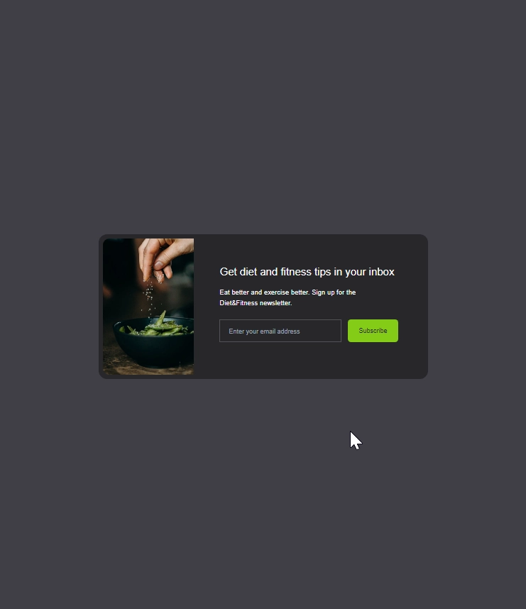

### 👋 **I am Erhan ERTEM**

&emsp;

## Udemy Tailwind CSS From Scratch Learn By Building Projects Brad Traversy

### **Objective:** Create mini website modules with tailwindcss

&emsp;

#### [Mini Tailwind Project Sandbox](https://tailwindprojectsandbox-erhan-ertem.netlify.app/)

---

